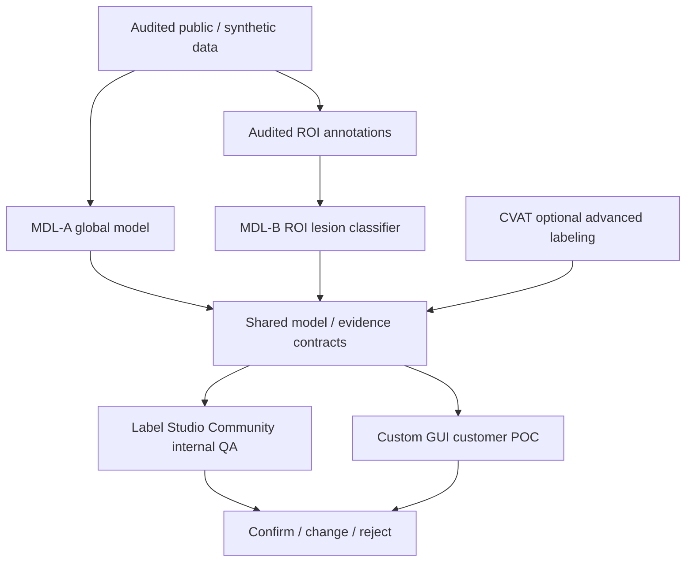

<p align="left"></p>

# A model-first foundation for retinal research and clinician review

Eye Detected connects model experiments to reviewable annotations through versioned
data contracts. The current POC benchmarks global retinal models first, then develops a separate spatial ROI
lesion track and integrates both through the customer-facing GUI reference.

**v0.2 · On-premises annotation storage and research pipelines · Research only · Python 3.11–3.12**

Target code source of truth: [siriponsri/OcuForge](https://github.com/siriponsri/OcuForge). The repository is live on GitHub. Start with [คู่มือเริ่มต้นภาษาไทย](docs/START_HERE_TH.md). Read the [delivery report](validation/FINAL_DELIVERY_REPORT.md) for measured validation status and external checks.

## Module Map

| ID | Module | Responsibility | Primary location / runtime |
|---|---|---|---|
| CTR | Contracts | Schemas, protocols, provenance, validation, shared interfaces | `eyes-detected-contracts/` |
| MDL | Models | Encoders, training, inference, evaluation, model evidence | `eyes-detected-models/` |
| LBL | Labeler | ROI review, Label Studio QA, CVAT integration | `eyes-detected-labeler/` |
| DAT | Local Data | Mongo metadata, immutable image objects, revisions, release/backup | `labeler_bridge/storage.py`, `deploy/onprem/` |
| RUN | Runtime / Deployment | Bootstrap, Docker/Compose, environment and execution boundaries | `bootstrap.cmd`, `scripts/`, `deploy/` |
| RSC | Research Control | Experiments, leakage controls, metrics, reproducibility, evidence claims | `docs/`, `validation/` |

Modules define architectural ownership. Phases define execution order and current project progress. See the
[normative module contract](docs/CTR_MODULE_CONTRACT.md) and the [human project map](docs/PROJECT_MAP.md).

## Current POC Direction

The authoritative plan is [POC Master Plan V2](docs/POC_MASTER_PLAN_V2.md). The previous interactive-lesion plan is
retired as a planning authority; see its historical pointer for preserved context.
The customer-facing flow is:

```text
retinal image -> global model result -> user-selected ROI -> lesion suggestion -> confirm / change / reject
```

The global DR model and ROI lesion classifier are separate tracks. R0 V2 is **READY TO EXECUTE, NOT PASSED**:
MMRDR UWF is a candidate global source and IDRiD is a candidate spatial ROI source pending the new supervision,
taxonomy, split, terms and checksum audit. R1 is a controlled G0-G5 benchmark; DINOv3 plus Attention MIL remains
a leading candidate, while CE versus CORAL is an ablation only for genuine ordinal labels. `NO_SUPPORTED_LESION_IN_ROI`
remains an ROI-local semantic rather than a claim that the eye is normal. Label Studio Community is internal ROI
QA; [templates/](templates/) is the preferred customer-facing GUI reference and must integrate through contracts/
adapters. CVAT remains optional advanced annotation infrastructure. DICOM, model monitoring, and HL7/FHIR remain
deferred.

## Project Status

| Work item | Status |
|---|---|
| Phase 0 - Repository foundation | PASS |
| Phase 1 - Baseline / portability | PASS |
| Machine bootstrap | PASS |
| Phase 2A - Docker-independent local data foundation | PASS |
| Phase 2B - Live MongoDB acceptance | PENDING / NOT RUN |
| R0 V2 - Dataset, supervision, taxonomy and split audit | READY TO EXECUTE; NOT PASSED |
| R1 - G0-G5 global model benchmark | READY; NOT EXECUTED |

Phase 2A passing does not mean that Phase 2 overall has passed.

## Workflow



The tracks import only the shared contracts, never each other's implementation. The synthetic integration demo
remains
an offline engineering check using `TinyTestEncoder` and a separately declared synthetic lesion point. It does
not
simulate successful DINOv3 inference or claim that MIL attention localizes lesions.

## Quick start

For a fresh Windows development machine or a new team member:

```cmd
git clone https://github.com/siriponsri/OcuForge.git
cd OcuForge
bootstrap.cmd
```

`bootstrap.cmd` creates or reuses the virtual environment, installs the CPU PyTorch 2.5.1 baseline, installs the three packages in editable mode and development requirements, bootstraps the pinned Codex skills, runs `pytest` and the synthetic roundtrip, and checks Docker capability. Docker is reported separately because it is optional for core Python development and is not started by bootstrap.

The normal new-machine flow is `clone -> bootstrap.cmd -> continue the current project phase`. A new machine does not restart project phases. Bootstrap only reconstructs and verifies local developer state; it does not reset repository changes or project state.

### Manual setup fallback

After installing Python 3.11 or 3.12, run from this repository root:

```bash
python -m venv .venv
# Linux/macOS: source .venv/bin/activate
# Windows PowerShell: .\.venv\Scripts\Activate.ps1
python -m pip install torch==2.5.1 --index-url https://download.pytorch.org/whl/cpu
python -m pip install -e ./eyes-detected-contracts -e ./eyes-detected-models -e ./eyes-detected-labeler -r requirements-dev.txt
python -m pytest
python scripts/synthetic_roundtrip.py
```

Installation needs package access once. Tests and the demo then run offline. No dataset, model checkpoint or API token is required. Outputs appear in `artifacts/` and are excluded from Git.

Docker path:

```bash
docker compose -f eyes-detected-models/compose.yaml config --quiet
docker compose -f eyes-detected-labeler/compose.yaml config --quiet
docker compose -f eyes-detected-models/compose.yaml build cpu-test
docker compose -f eyes-detected-models/compose.yaml run --rm cpu-test
```

The build needs internet for dependencies; the CPU demo container runs with no network.
Existing CVAT integration uses
its upstream deployment; see [CVAT setup](eyes-detected-labeler/docs/CVAT_SETUP_TH.md).

## Data meaning and clinical scope

The user's local data has **DR / no-DR experience-based image assessments**, with no five-grade labels or localized lesion annotations. These remain binary assessments with explicit provenance. They are never converted automatically into ordinal grades or masks.

The default grading reference is **ICO Guidelines for Diabetic Eye Care, Updated 2017**, Table 1, printed page 2. Its [versioned configuration](eyes-detected-contracts/protocols/ico_2017_dr.v0.1.json) is attached to grading annotations and predictions by ID, version and hash. Future protocol changes preserve historical meaning.

AI predictions, evidence maps and candidate lesions are research outputs. DME is a separate assessment; a fundus/UWF image alone is not OCT-confirmed DME. No autonomous diagnosis, referral, clinical validation or production model update is included.

## Integration status

| Component | Status |
|---|---|
| Core Python pipeline and synthetic roundtrip | Implemented; see test evidence |
| DINOv3 ViT-B/16 | Adapter and failure tests; **REQUIRES_MODEL_WEIGHTS** |
| CVAT | API/config adapter; **REQUIRES_EXTERNAL_SERVICE** for live verification |
| Docker / GPU image | Configuration supplied; runtime verification reported separately |
| Vast.ai / RunPod | Docker/Compose and public-only pipeline launcher supplied; GPU runtime unverified |
| FiftyOne | Optional adapter; external integration unverified |
| R1 G0-G5 global benchmark | **READY; requires R0 V2 evidence and authorized model/data assets** |
| ROI lesion classifier | **SEPARATE TRACK; after spatial R0 audit** |
| Customer-facing GUI reference | **templates/; static mock-first package** |

## On-premises storage and expanded pipelines

Hospital images, labels, features, predictions, checkpoints and backups stay on hospital-owned infrastructure. MongoDB stores metadata and immutable annotation revisions; local disks/NAS store image objects by SHA-256. CVAT retains its own PostgreSQL and volumes. GitHub stores code/configuration and synthetic fixtures only.

- [แผน NoSQL ภายในโรงพยาบาล](docs/ON_PREMISE_NOSQL_PLAN_TH.md): schema, versioning, access boundaries, capacity, backup and restore acceptance.
- [Local MongoDB Compose](deploy/onprem/README.md): authenticated database with no published port, local image ingestion and trusted operator commands (`eyes-local`).
- [Model pipeline runbook](docs/PIPELINE_RUNBOOK_TH.md): audit → frozen DINO features → binary or ordinal MIL → held-out evaluation → prediction export (`eyes-pipeline`).
- [Labeler task workflow](docs/LOCAL_LABELER_WORKFLOW_TH.md): durable task state, explicit review,
  immutable revisions and expert finalization. Existing CVAT workflow is retained; Label Studio
  Community is the internal ROI QA workbench; `templates/` is the customer-facing UX reference. Both must use
  shared contracts and adapters.

Public GPU work uses configurable storage roots so the same commands can run on RunPod Network Volume or another
approved filesystem:

```text
OCUFORGE_DATA_ROOT=/workspace/data
OCUFORGE_MODEL_ROOT=/workspace/models
OCUFORGE_CACHE_ROOT=/workspace/cache
OCUFORGE_ARTIFACT_ROOT=/workspace/artifacts
```

The preferred RunPod layout is `data/mmrdr`, `data/idrid`, `data/manifests`, `models/dinov3`,
`cache/features`, and `artifacts/experiments`. RunPod is optional, not a code dependency. Dataset bytes, model
weights, feature caches, checkpoints, and predictions stay outside Git; GitHub stores code, safe manifests,
hashes, and metadata only. Download reviewed public data directly to the mounted volume when a future GPU gate
authorizes it. Do not provision a provider or download a large dataset in the current R0 V2 reconciliation gate.

Vast.ai/RunPod runners accept only reviewed public or synthetic manifests and public model assets. No automatic
transfer or provisioning is implemented. Hospital data and derived artifacts remain on-premises. Vercel is
reserved for synthetic demos/documentation; the clinical application is not deployed there. MongoDB/CVAT/GPU
live deployment remains a target-host acceptance gate; see the measured report.

## Documentation

- [Architecture and boundaries](docs/DUAL_TRACK_ARCHITECTURE.md)
- [Authoritative POC master plan](docs/POC_MASTER_PLAN_V2.md)
- [GUI POC integration contract](docs/GUI_POC_INTEGRATION.md)
- [Customer-facing GUI reference](templates/README.md)
- [ICO grading and version changes](docs/GRADING_PROTOCOL_TH.md)
- [Local setup](docs/LOCAL_SETUP_TH.md) · [GPU execution](docs/GPU_EXECUTION_TH.md)
- [Data and source limitations](eyes-detected-models/docs/DATASETS.md)
- [R0 V2 dataset/supervision audit record](docs/RSC_R0_DATASET_TAXONOMY_FREEZE_v0.1.json)
- [R1 G0-G5 benchmark configuration](eyes-detected-models/configs/research/r1-global-benchmark.json)
- [Safety and scope](docs/SAFETY_AND_SCOPE.md)
- [Implementation status](docs/IMPLEMENTATION_STATUS.md) · [Next steps](docs/NEXT_STEPS.md)

No weights, hospital images, PHI or credentials are distributed. Third-party model and dataset terms remain separate; see [source review](docs/SOURCE_REVIEW.md). No open-source license grant for the project owner's code is assumed; choose a repository license before external reuse.
