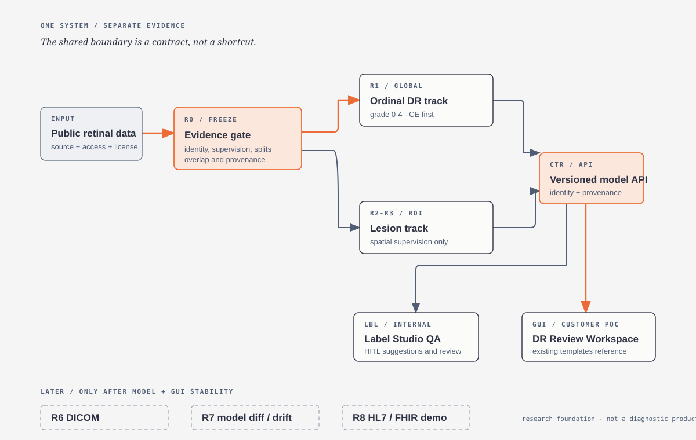
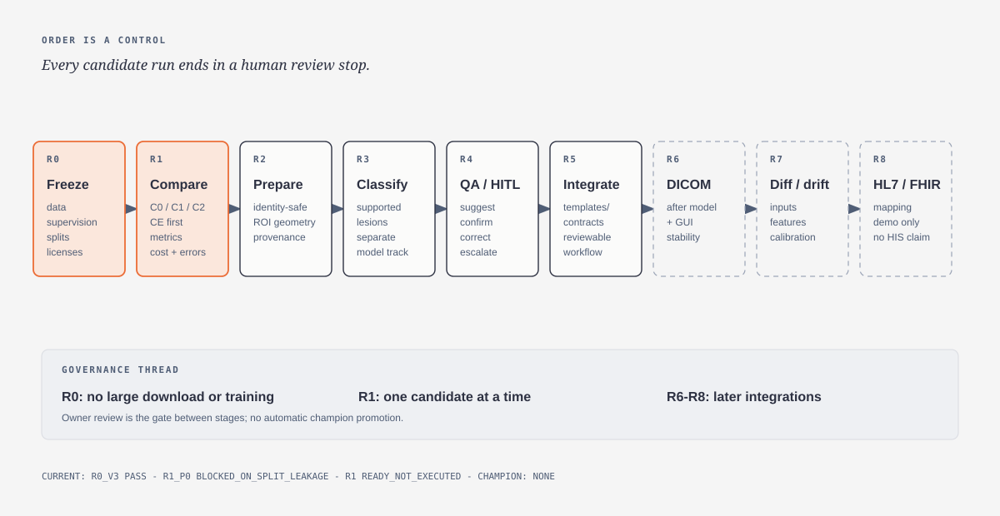
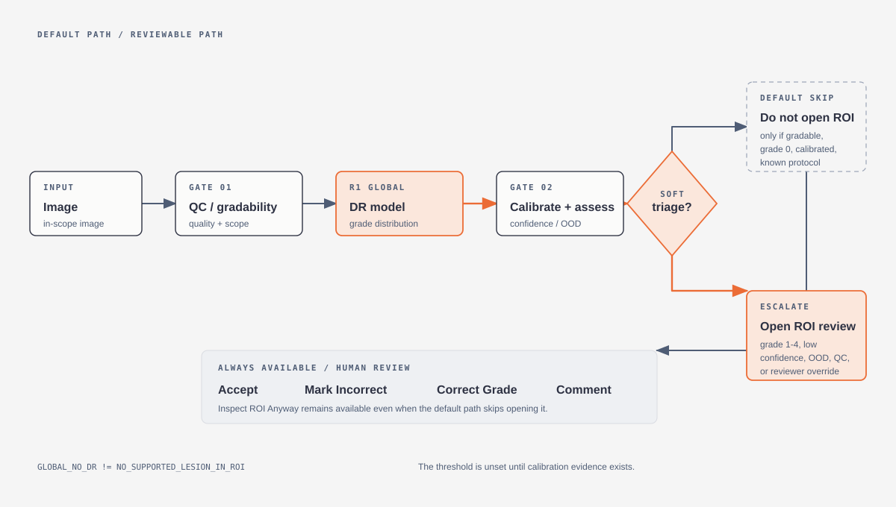
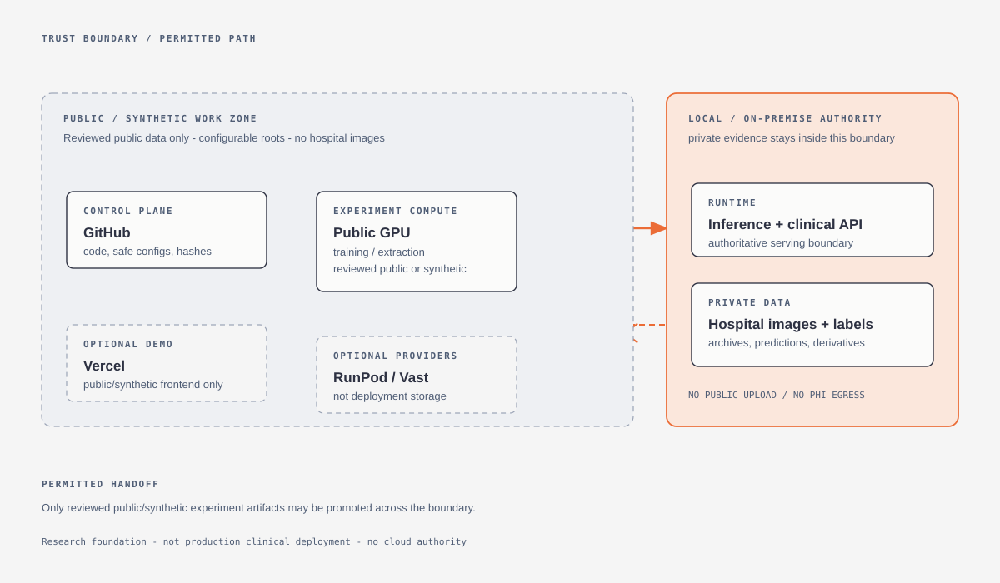

<p align="left"></p>

# OcuForge / V3 Research and Review Foundation

OcuForge is a research and clinician-review foundation for retinal imaging workflows. It is not a diagnostic
product. The only active direction is [`docs/POC_MASTER_PLAN.md`](docs/POC_MASTER_PLAN.md), plan version 3.0.



## Current Gate

```text
R0_V3 = BLOCKED
R1 C0/C1/C2 = READY_NOT_EXECUTED
CURRENT_R1_CHAMPION = NONE
```

R0 evidence review is complete but blocked on exact dataset terms/checksums/identity evidence, IDRiD negative ROI
semantics, and candidate asset hash/overlap evidence. No data or weights were downloaded, no model was trained, and
no cloud compute was provisioned. The exact blockers and future download manifest are in the
[`R0 freeze record`](docs/RSC_R0_DATASET_TAXONOMY_FREEZE_v0.1.json).

## New Direction



R0 freezes source/version/access, supervision semantics, identity-safe splits, licenses, checksums, negative-ROI
policy, and foundation-model pretraining overlap before execution. R1 compares exactly three global ordinal DR
architectures, all with cross-entropy first:

| Candidate | Scientific question | Initial architecture |
|---|---|---|
| C0 | Does compact supervised transfer solve enough? | ConvNeXt V2-Tiny |
| C1 | Does retinal-domain pretraining transfer? | FLAIR image encoder |
| C2 | Does high-resolution local detail matter? | DINOv3 ViT-B/16 + patch Attention MIL |

Each candidate runs one at a time and stops for review. After a winner or finalist is selected from validation
evidence, the planned ordinal ablation is winner + CE versus winner + CORN. No current champion is configured.

## Global and ROI Workflow

Global DR grading and ROI lesion classification are separate model tracks with separate supervision, heads,
evaluations, artifacts, and identities. MIL attention is aggregation evidence, not a validated lesion mask.



The Global-to-ROI gate is soft and reviewable. A default ROI skip requires a gradable in-scope image, predicted grade
0, a validated calibration threshold, no QC or OOD trigger, and a known protocol. The threshold is currently unset.
Reviewer actions always remain available: Accept, Mark Incorrect, Correct Grade, Comment, and Inspect ROI Anyway.
`GLOBAL_NO_DR` is never the same semantic as `NO_SUPPORTED_LESION_IN_ROI`.

The existing [`templates/`](templates/) DR Review Workspace is the customer-facing GUI reference. Label Studio
Community is the internal ROI QA and HITL workbench. CVAT is optional advanced annotation infrastructure.

## Data Boundary



- GitHub stores code, safe configuration, manifests, metadata, hashes, reports, and synthetic fixtures.
- Public GPU is temporary experiment compute for reviewed public or synthetic data only.
- RunPod and Vast are optional providers, not deployment or production storage.
- Local/on-premise is authoritative for inference, clinical integration, and all hospital/private data and derivatives.
- Fundus or UWF evidence is not OCT-confirmed DME. Binary experience labels are not ordinal grades 0-4.

## Quick Start

```cmd
git clone https://github.com/siriponsri/OcuForge.git
cd OcuForge
bootstrap.cmd
```

Offline checks:

```powershell
.\.venv\Scripts\python.exe -m pytest
.\.venv\Scripts\python.exe -m ruff check .
.\.venv\Scripts\python.exe scripts\validate_configs.py
.\.venv\Scripts\python.exe scripts\package_check.py
```

These checks do not download data, access private assets, execute R0 or R1, or claim model performance.

## Active Plan

- [V3 master plan](docs/POC_MASTER_PLAN.md) - authoritative roadmap and execution gate.
- [R0 data and supervision freeze](docs/R0_DATASET_SUPERVISION_FREEZE.md) - evidence and provenance gate.
- [R1 global model selection](docs/R1_GLOBAL_MODEL_SELECTION.md) - C0/C1/C2 benchmark protocol.
- [Implementation status](docs/IMPLEMENTATION_STATUS.md) - repository readiness and unresolved gates.
- [Module contract](docs/CTR_MODULE_CONTRACT.md) - contracts-first ownership and runtime boundaries.
- [GUI integration](docs/GUI_POC_INTEGRATION.md) - existing customer-facing workspace integration.
- [Diagram Design integration](docs/DIAGRAM_DESIGN.md) - editable diagram source and verification.
