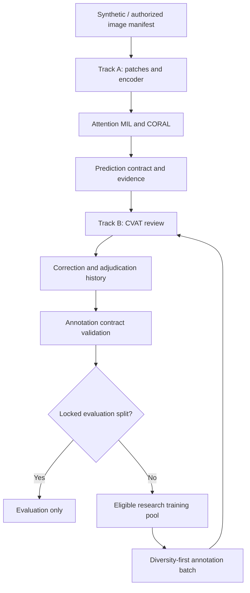

<p align="left"></p>

# A foundation for retinal model research and clinician annotation

Eye Detected connects model experiments to reviewable annotations through versioned data contracts. Researchers can develop the model pipeline while the annotation workflow is prepared independently.

**v0.2 · On-premises annotation storage and research pipelines · Research only · Python 3.11–3.12**

Target code source of truth: [siriponsri/OcuForge](https://github.com/siriponsri/OcuForge). The repository is live on GitHub. Start with [คู่มือเริ่มต้นภาษาไทย](docs/START_HERE_TH.md). Read the [delivery report](validation/FINAL_DELIVERY_REPORT.md) for measured validation status and external checks.

## Workspace

| Package | Responsibility | Executable starter |
|---|---|---|
| `eyes-detected-models` | Model research | Deterministic patches, feature store, Attention MIL, CORAL, QC and lesion heads, diversity selection |
| `eyes-detected-labeler` | CVAT integration | Geometry conversion, explicit correction journal, annotation export and session summary |
| `eyes-detected-contracts` | Shared interface | Seven versioned schemas, semantic validation, split checks and ICO protocol identity |

## Workflow



The tracks import only the shared contracts, never each other's implementation. The synthetic integration demo runs real CPU optimization with `TinyTestEncoder`, then converts a **separately declared synthetic lesion point** through the review workflow. It does not simulate successful DINOv3 inference or claim that MIL attention localizes lesions.

## Quick start

For a fresh Windows development machine or a new team member:

```cmd
git clone https://github.com/siriponsri/OcuForge.git
cd OcuForge
bootstrap.cmd
```

`bootstrap.cmd` creates or reuses the virtual environment, installs the CPU PyTorch 2.5.1 baseline, installs the three packages in editable mode and development requirements, bootstraps the pinned Codex skills, runs `pytest` and the synthetic roundtrip, and checks Docker capability. Docker is reported separately because it is optional for core Python development and is not started by bootstrap.

The normal new-machine flow is `clone -> bootstrap.cmd -> continue the current project phase`. A new machine does not restart project phases. Bootstrap only reconstructs and verifies local developer state; it does not reset repository changes or project state.

### Manual setup fallback

After installing Python 3.11 or 3.12, run from this repository root:

```bash
python -m venv .venv
# Linux/macOS: source .venv/bin/activate
# Windows PowerShell: .\.venv\Scripts\Activate.ps1
python -m pip install torch==2.5.1 --index-url https://download.pytorch.org/whl/cpu
python -m pip install -e ./eyes-detected-contracts -e ./eyes-detected-models -e ./eyes-detected-labeler -r requirements-dev.txt
python -m pytest
python scripts/synthetic_roundtrip.py
```

Installation needs package access once. Tests and the demo then run offline. No dataset, model checkpoint or API token is required. Outputs appear in `artifacts/` and are excluded from Git.

Docker path:

```bash
docker compose -f eyes-detected-models/compose.yaml config --quiet
docker compose -f eyes-detected-labeler/compose.yaml config --quiet
docker compose -f eyes-detected-models/compose.yaml build cpu-test
docker compose -f eyes-detected-models/compose.yaml run --rm cpu-test
```

The build needs internet for dependencies; the CPU demo container runs with no network. CVAT uses its upstream deployment; see [CVAT setup](eyes-detected-labeler/docs/CVAT_SETUP_TH.md).

## Data meaning and clinical scope

The user's local data has **DR / no-DR experience-based image assessments**, with no five-grade labels or localized lesion annotations. These remain binary assessments with explicit provenance. They are never converted automatically into ordinal grades or masks.

The default grading reference is **ICO Guidelines for Diabetic Eye Care, Updated 2017**, Table 1, printed page 2. Its [versioned configuration](eyes-detected-contracts/protocols/ico_2017_dr.v0.1.json) is attached to grading annotations and predictions by ID, version and hash. Future protocol changes preserve historical meaning.

AI predictions, evidence maps and candidate lesions are research outputs. DME is a separate assessment; a fundus/UWF image alone is not OCT-confirmed DME. No autonomous diagnosis, referral, clinical validation or production model update is included.

## Integration status

| Component | Status |
|---|---|
| Core Python pipeline and synthetic roundtrip | Implemented; see test evidence |
| DINOv3 ViT-B/16 | Adapter and failure tests; **REQUIRES_MODEL_WEIGHTS** |
| CVAT | API/config adapter; **REQUIRES_EXTERNAL_SERVICE** for live verification |
| Docker / GPU image | Configuration supplied; runtime verification reported separately |
| Vast.ai / RunPod | Docker/Compose and public-only pipeline launcher supplied; GPU runtime unverified |
| FiftyOne | Optional adapter; external integration unverified |
| Lesion detector, local adaptation, main benchmark | **PLANNED** |

## On-premises storage and expanded pipelines

Hospital images, labels, features, predictions, checkpoints and backups stay on hospital-owned infrastructure. MongoDB stores metadata and immutable annotation revisions; local disks/NAS store image objects by SHA-256. CVAT retains its own PostgreSQL and volumes. GitHub stores code/configuration and synthetic fixtures only.

- [แผน NoSQL ภายในโรงพยาบาล](docs/ON_PREMISE_NOSQL_PLAN_TH.md): schema, versioning, access boundaries, capacity, backup and restore acceptance.
- [Local MongoDB Compose](deploy/onprem/README.md): authenticated database with no published port, local image ingestion and trusted operator commands (`eyes-local`).
- [Model pipeline runbook](docs/PIPELINE_RUNBOOK_TH.md): audit → frozen DINO features → binary or ordinal MIL → held-out evaluation → prediction export (`eyes-pipeline`).
- [Labeler task workflow](docs/LOCAL_LABELER_WORKFLOW_TH.md): durable task state, explicit review, immutable revisions and expert finalization. CVAT is the annotation UI; this release adds no custom web editor.

Vast.ai/RunPod runners accept only reviewed public or synthetic manifests. No automatic transfer or provisioning is implemented. Vercel is reserved for synthetic demos/documentation; the clinical application is not deployed there. MongoDB/CVAT/GPU live deployment remains a target-host acceptance gate; see the measured report.

## Documentation

- [Architecture and boundaries](docs/DUAL_TRACK_ARCHITECTURE.md)
- [ICO grading and version changes](docs/GRADING_PROTOCOL_TH.md)
- [Local setup](docs/LOCAL_SETUP_TH.md) · [GPU execution](docs/GPU_EXECUTION_TH.md)
- [Data and source limitations](eyes-detected-models/docs/DATASETS.md)
- [Safety and scope](docs/SAFETY_AND_SCOPE.md)
- [Implementation status](docs/IMPLEMENTATION_STATUS.md) · [Next steps](docs/NEXT_STEPS.md)

No weights, hospital images, PHI or credentials are distributed. Third-party model and dataset terms remain separate; see [source review](docs/SOURCE_REVIEW.md). No open-source license grant for the project owner's code is assumed; choose a repository license before external reuse.
