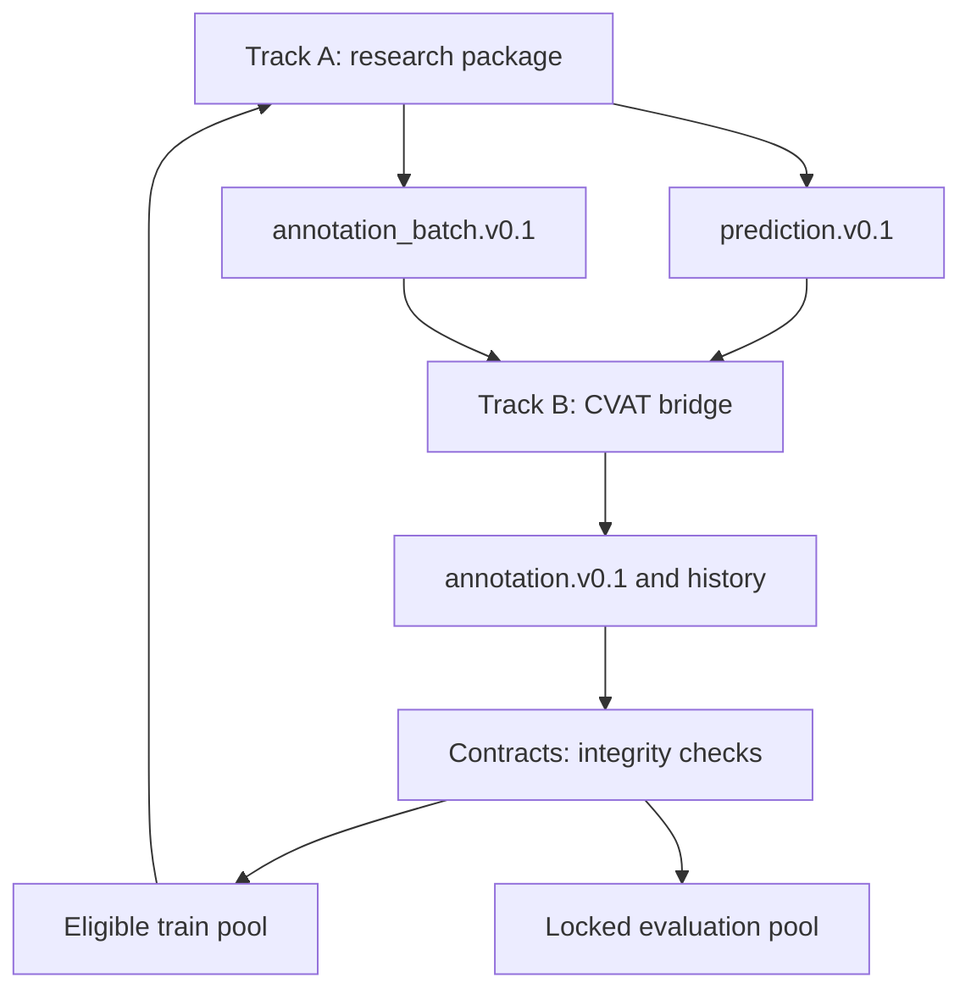

# Dual-track architecture

Contracts contain no torch or CVAT implementation. The root integration script orchestrates both packages through files. Seven schemas are generated from Pydantic models. JSON Schema validates structural constraints; the Python validator also enforces geometry, modality/provenance, protocol and cross-record invariants.

Image coordinates use normalized pixel centers: x=0..width-1, y=0..height-1. Patches use canvas crop edges and explicit source affine mapping; source coordinates may extend into letterbox padding and must be clipped only for display. Source images are never silently cropped.

Feature cache identity covers encoder weights, preprocessing, geometry, dimensions, dataset/image identity and runtime provenance. Sentinel/validation/test records cannot enter trainable annotation queues. Training ingest additionally requires a TRAIN image, non-AI origin and eligible review state. Patient, eye, visit and exact-hash overlaps fail validation.

ICO protocol identity belongs to each grading record. Binary experience assessments are source metadata, not a missing ordinal grade to fill automatically. A future schema change needs a migration note and explicit revalidation.
