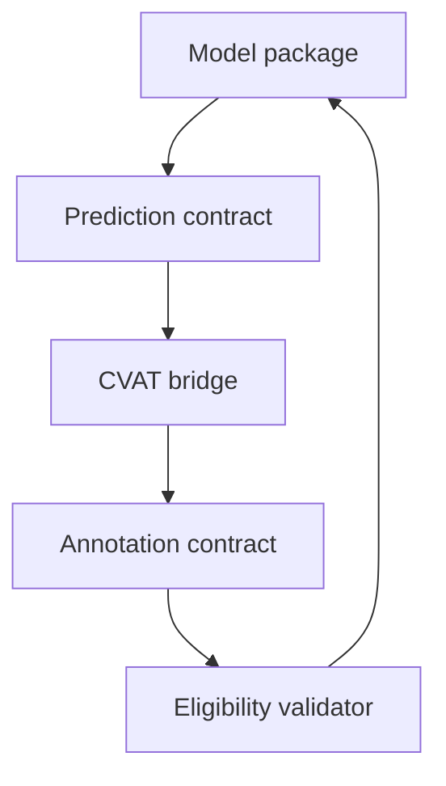

# Track B · Annotation bridge

CVAT-backed geometry conversion and provenance-preserving annotation workflows. No custom editor.

Research-only · contract version v0.1 · no weights, hospital data or credentials.

Run from the **parent workspace root**, after [installation](../docs/START_HERE_TH.md):

```bash
python -m labeler_bridge.cli import-demo-predictions --smoke-dir artifacts/smoke --out artifacts/roundtrip
python -m pytest
```

Configuration and examples live in this package; model and labeler packages consume `eyes-detected-contracts==0.1.0` independently.



See [implementation status](../docs/IMPLEMENTATION_STATUS.md), [safety](../docs/SAFETY_AND_SCOPE.md) and [Thai quickstart](QUICKSTART_TH.md).

Docker validation from workspace root:

```bash
docker compose -f eyes-detected-models/compose.yaml config --quiet
docker compose -f eyes-detected-labeler/compose.yaml config --quiet
```
